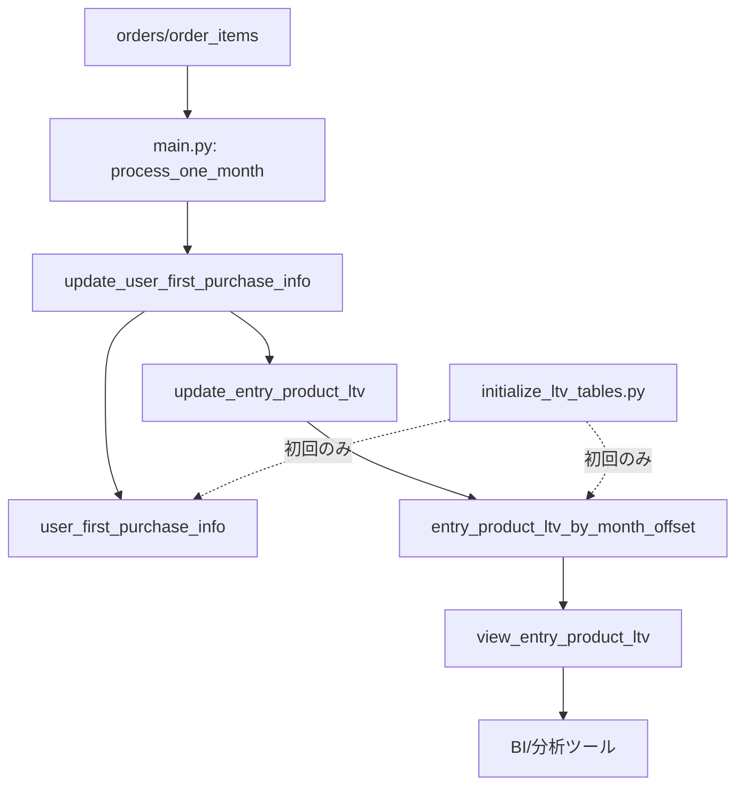

# Rakuten BQ Pipeline LTV テーブル化 実装計画（完全版）

## 概要

- `month_offset`の上限（0〜12）を撤廃し、13以降も含めて年単位のLTVデータを蓄積
- 初回購入者判定の再計算コストを削減するため、初回購入情報をテーブル化
- LTV集計をテーブル化し、`view_entry_product_ltv`を新テーブル参照のビューに置き換え
- `main.py`の月次バッチ処理にLTVテーブル更新を統合

## 全体アーキテクチャ



## フェーズ1: テーブル設計とDDL作成

### 1-1. `user_first_purchase_info` テーブル

**目的**: 初回購入者情報を保存し、再計算コストを削減

**DDL**:

```sql
CREATE TABLE IF NOT EXISTS `{project_id}.{dataset}.user_first_purchase_info` (
  user_email STRING NOT NULL OPTIONS(description="ユーザー識別子（マスキング済み）"),
  first_order_number STRING NOT NULL OPTIONS(description="初回注文番号"),
  first_order_date DATE NOT NULL OPTIONS(description="初回購入日（JST）"),
  first_order_month DATE NOT NULL OPTIONS(description="初回購入月（JST、月初）"),
  entry_manage_number STRING NOT NULL OPTIONS(description="入口商品管理番号（subtotal最大の商品）"),
  entry_item_name STRING OPTIONS(description="入口商品名（初回購入時点）"),
  updated_at TIMESTAMP NOT NULL OPTIONS(description="最終更新日時")
)
OPTIONS(
  description="初回購入者情報テーブル。初回購入情報は不変のため、一度登録されたユーザーは更新しない。"
);
```

**インデックス**（暗黙的に主キーとして扱う）:

- `user_email`（1ユーザー1レコード）

### 1-2. `entry_product_ltv_by_month_offset` テーブル

**目的**: LTV集計データを保存し、month_offset上限なしで対応

**DDL**:

```sql
CREATE TABLE IF NOT EXISTS `{project_id}.{dataset}.entry_product_ltv_by_month_offset` (
  entry_manage_number STRING NOT NULL OPTIONS(description="入口商品管理番号"),
  entry_item_name STRING OPTIONS(description="入口商品名"),
  first_order_month DATE NOT NULL OPTIONS(description="初回購入月（JST、月初）"),
  month_offset INT64 NOT NULL OPTIONS(description="初回購入月からの経過月数（0=初月、上限なし）"),
  cohort_users INT64 NOT NULL OPTIONS(description="入口商品×デビュー月の人数（ユニークユーザー）"),
  active_buyers INT64 NOT NULL OPTIONS(description="該当月に購入があった人数"),
  revenue_in_month NUMERIC NOT NULL OPTIONS(description="該当月の売上合計（orders.total_price）"),
  cumulative_revenue NUMERIC NOT NULL OPTIONS(description="初月からの累計売上"),
  ltv_per_user NUMERIC OPTIONS(description="1人あたりLTV（累計売上/コホート人数）"),
  aov_in_month NUMERIC OPTIONS(description="該当月の購入単価（売上/購入人数）"),
  updated_at TIMESTAMP NOT NULL OPTIONS(description="最終更新日時")
)
PARTITION BY first_order_month
CLUSTER BY entry_manage_number, month_offset
OPTIONS(
  description="入口商品別LTVテーブル。active_buyers=0かつrevenue_in_month=0の行は保存しない。"
);
```

**インデックス**（暗黙的に主キーとして扱う）:

- `entry_manage_number`, `first_order_month`, `month_offset`

## フェーズ2: テーブル作成関数の実装

### 2-1. `deploy_views.py`に関数追加

**実装場所**: [deploy_views.py](deploy_views.py) の`main()`関数の前

```python
def create_user_first_purchase_table():
    """初回購入情報テーブルを作成"""
    client = get_client()
    table_id = f"{PROJECT_ID}.{BQ_DATASET}.user_first_purchase_info"
    
    ddl = f"""
    CREATE TABLE IF NOT EXISTS `{table_id}` (
      user_email STRING NOT NULL,
      first_order_number STRING NOT NULL,
      first_order_date DATE NOT NULL,
      first_order_month DATE NOT NULL,
      entry_manage_number STRING NOT NULL,
      entry_item_name STRING,
      updated_at TIMESTAMP NOT NULL
    )
    OPTIONS(
      description="初回購入者情報テーブル"
    )
    """
    
    job = client.query(ddl)
    job.result()
    logging.info(f"Created/Updated table: {table_id}")


def create_ltv_table():
    """LTV集計テーブルを作成"""
    client = get_client()
    table_id = f"{PROJECT_ID}.{BQ_DATASET}.entry_product_ltv_by_month_offset"
    
    ddl = f"""
    CREATE TABLE IF NOT EXISTS `{table_id}` (
      entry_manage_number STRING NOT NULL,
      entry_item_name STRING,
      first_order_month DATE NOT NULL,
      month_offset INT64 NOT NULL,
      cohort_users INT64 NOT NULL,
      active_buyers INT64 NOT NULL,
      revenue_in_month NUMERIC NOT NULL,
      cumulative_revenue NUMERIC NOT NULL,
      ltv_per_user NUMERIC,
      aov_in_month NUMERIC,
      updated_at TIMESTAMP NOT NULL
    )
    PARTITION BY first_order_month
    CLUSTER BY entry_manage_number, month_offset
    OPTIONS(
      description="入口商品別LTVテーブル"
    )
    """
    
    job = client.query(ddl)
    job.result()
    logging.info(f"Created/Updated table: {table_id}")
```

### 2-2. `deploy_views.py`の`main()`関数に追加

```python
def main():
    # テーブル作成（初回のみ実行、既存の場合はスキップ）
    create_user_first_purchase_table()
    create_ltv_table()
    
    # 既存のビュー作成処理
    # 1. view_monthly_ltv
    sql_ltv = f"""
    ...
```

## フェーズ3: 初回購入情報テーブル更新処理

### 3-1. `ltv_updater.py`（新規ファイル）を作成

**ファイル構成**:

```
rakuten-bq-pipeline/
├── ltv_updater.py          # 新規作成
├── main.py
├── deploy_views.py
...
```

**実装内容**:

```python
import os
import logging
from datetime import datetime
from google.cloud import bigquery
from typing import Optional

PROJECT_ID = os.getenv("PROJECT_ID")
BQ_DATASET = os.getenv("BQ_DATASET", "rakuten_orders")
BQ_LOCATION = os.getenv("BQ_LOCATION", "asia-northeast1")


def get_client():
    return bigquery.Client(project=PROJECT_ID, location=BQ_LOCATION)


def update_user_first_purchase_info(processed_month_start: datetime) -> dict:
    """
    初回購入情報テーブルを更新（該当月の新規ユーザーのみ）
    
    Args:
        processed_month_start: 処理対象月の月初（JST）
    
    Returns:
        dict: 更新結果（inserted_users数など）
    """
    client = get_client()
    
    # 処理対象月の開始・終了を計算
    from dateutil.relativedelta import relativedelta
    month_start = processed_month_start.strftime("%Y-%m-%d")
    month_end = (processed_month_start + relativedelta(months=1)).strftime("%Y-%m-%d")
    
    sql = f"""
    MERGE `{PROJECT_ID}.{BQ_DATASET}.user_first_purchase_info` AS T
    USING (
      WITH product_master AS (
        SELECT
          manage_number,
          ARRAY_AGG(NULLIF(product_name, '') IGNORE NULLS ORDER BY LENGTH(product_name) DESC LIMIT 1)[OFFSET(0)] AS product_name
        FROM `{PROJECT_ID}.{BQ_DATASET}.product_master_raw`
        GROUP BY 1
      ),
      base_orders AS (
        SELECT
          order_number,
          user_email,
          DATE(order_datetime, "Asia/Tokyo") AS order_date,
          DATE_TRUNC(DATE(order_datetime, "Asia/Tokyo"), MONTH) AS order_month
        FROM `{PROJECT_ID}.{BQ_DATASET}.orders`
        WHERE order_status != '900'
      ),
      user_first_order AS (
        SELECT
          user_email,
          order_number AS first_order_number,
          order_date AS first_order_date,
          order_month AS first_order_month
        FROM (
          SELECT
            order_number,
            user_email,
            order_date,
            order_month,
            ROW_NUMBER() OVER(PARTITION BY user_email ORDER BY order_date ASC) AS rn
          FROM base_orders
        )
        WHERE rn = 1
          AND order_month >= '{month_start}'
          AND order_month < '{month_end}'
      ),
      entry_products AS (
        SELECT
          u.user_email,
          u.first_order_number,
          u.first_order_date,
          u.first_order_month,
          i.manage_number AS entry_manage_number,
          COALESCE(pm.product_name, i.item_name) AS entry_item_name,
          i.subtotal,
          ROW_NUMBER() OVER(
            PARTITION BY u.user_email 
            ORDER BY i.subtotal DESC, i.manage_number ASC
          ) AS rn
        FROM user_first_order u
        JOIN `{PROJECT_ID}.{BQ_DATASET}.order_items` i
          ON i.order_number = u.first_order_number
        LEFT JOIN product_master pm
          ON pm.manage_number = i.manage_number
        WHERE i.manage_number IS NOT NULL
      )
      SELECT
        user_email,
        first_order_number,
        first_order_date,
        first_order_month,
        entry_manage_number,
        entry_item_name,
        CURRENT_TIMESTAMP() AS updated_at
      FROM entry_products
      WHERE rn = 1
    ) AS S
    ON T.user_email = S.user_email
    WHEN NOT MATCHED THEN
      INSERT (user_email, first_order_number, first_order_date, first_order_month, 
              entry_manage_number, entry_item_name, updated_at)
      VALUES (S.user_email, S.first_order_number, S.first_order_date, S.first_order_month,
              S.entry_manage_number, S.entry_item_name, S.updated_at)
    """
    
    logging.info(f"Updating user_first_purchase_info for month: {month_start}")
    job = client.query(sql)
    result = job.result()
    
    # 挿入行数を取得
    stats = job._properties.get('statistics', {}).get('query', {})
    dml_stats = stats.get('dmlStats', {})
    inserted_rows = dml_stats.get('insertedRowCount', 0)
    
    logging.info(f"user_first_purchase_info updated: {inserted_rows} new users")
    
    return {
        "inserted_users": int(inserted_rows) if inserted_rows else 0,
        "month": month_start
    }


def update_entry_product_ltv(processed_month_start: datetime) -> dict:
    """
    LTV集計テーブルを更新
    
    該当月の新規データにより、過去のコホートの累計売上も変わる可能性があるため、
    全期間のデータを再計算する。
    
    Args:
        processed_month_start: 処理対象月の月初（JST）
    
    Returns:
        dict: 更新結果（affected_rows数など）
    """
    client = get_client()
    
    # LTV集計SQLを実行
    sql = f"""
    CREATE OR REPLACE TABLE `{PROJECT_ID}.{BQ_DATASET}.entry_product_ltv_by_month_offset` AS
    WITH base_orders AS (
      SELECT
        user_email,
        total_price,
        DATE_TRUNC(DATE(order_datetime, "Asia/Tokyo"), MONTH) AS order_month
      FROM `{PROJECT_ID}.{BQ_DATASET}.orders`
      WHERE order_status != '900'
    ),
    user_monthly_sales AS (
      SELECT
        user_email,
        order_month,
        SUM(total_price) AS monthly_sales
      FROM base_orders
      GROUP BY 1, 2
    ),
    user_cohort_sales AS (
      SELECT
        ufp.entry_manage_number,
        ufp.entry_item_name,
        ufp.first_order_month,
        DATE_DIFF(ums.order_month, ufp.first_order_month, MONTH) AS month_offset,
        ums.user_email,
        ums.monthly_sales
      FROM `{PROJECT_ID}.{BQ_DATASET}.user_first_purchase_info` ufp
      JOIN user_monthly_sales ums
        ON ufp.user_email = ums.user_email
      WHERE DATE_DIFF(ums.order_month, ufp.first_order_month, MONTH) >= 0
    ),
    cohort_counts AS (
      SELECT
        entry_manage_number,
        entry_item_name,
        first_order_month,
        COUNT(DISTINCT user_email) AS cohort_users
      FROM `{PROJECT_ID}.{BQ_DATASET}.user_first_purchase_info`
      GROUP BY 1, 2, 3
    ),
    monthly_aggregated AS (
      SELECT
        ucs.entry_manage_number,
        ucs.entry_item_name,
        ucs.first_order_month,
        ucs.month_offset,
        cc.cohort_users,
        COUNT(DISTINCT ucs.user_email) AS active_buyers,
        SUM(ucs.monthly_sales) AS revenue_in_month
      FROM user_cohort_sales ucs
      JOIN cohort_counts cc
        ON ucs.entry_manage_number = cc.entry_manage_number
        AND ucs.first_order_month = cc.first_order_month
      GROUP BY 1, 2, 3, 4, 5
    )
    SELECT
      entry_manage_number,
      entry_item_name,
      first_order_month,
      month_offset,
      cohort_users,
      active_buyers,
      revenue_in_month,
      SUM(revenue_in_month) OVER (
        PARTITION BY entry_manage_number, first_order_month 
        ORDER BY month_offset
      ) AS cumulative_revenue,
      SAFE_DIVIDE(
        SUM(revenue_in_month) OVER (
          PARTITION BY entry_manage_number, first_order_month 
          ORDER BY month_offset
        ),
        cohort_users
      ) AS ltv_per_user,
      SAFE_DIVIDE(revenue_in_month, NULLIF(active_buyers, 0)) AS aov_in_month,
      CURRENT_TIMESTAMP() AS updated_at
    FROM monthly_aggregated
    WHERE active_buyers > 0 OR revenue_in_month > 0
    ORDER BY first_order_month DESC, entry_manage_number, month_offset
    """
    
    logging.info("Updating entry_product_ltv_by_month_offset (full recalculation)")
    job = client.query(sql)
    result = job.result()
    
    # 更新行数を取得
    total_rows = result.total_rows if hasattr(result, 'total_rows') else 0
    
    logging.info(f"entry_product_ltv_by_month_offset updated: {total_rows} rows")
    
    return {
        "total_rows": total_rows
    }
```

### 3-2. `main.py`への統合

**変更箇所**: [main.py](main.py) の`process_one_month()`関数の最後

```python
def process_one_month(m_start_jst: datetime, m_end_jst: datetime) -> dict:
    """
    1か月（[m_start_jst, m_end_jst)）分の注文を取得→保存→正規化→BQ反映
    """
    # ... 既存の処理（注文データ取り込み） ...
    
    # 4) BigQuery 反映（該当月は完全更新：削除→挿入）
    replace_month_with_dataframes(
        orders_df=orders_df,
        order_items_df=order_items_df,
        orders_table=f"{BQ_DATASET}.{BQ_TABLE_ORDERS}",
        items_table=f"{BQ_DATASET}.{BQ_TABLE_ORDER_ITEMS}",
        ts_column_orders="order_datetime",
        ts_column_items="order_datetime",
        month_start_iso=start_iso_bq,
        month_end_iso=end_iso_bq,
    )
    
    # 5) 初回購入情報テーブル更新（エラーハンドリング）
    first_purchase_result = None
    try:
        from ltv_updater import update_user_first_purchase_info
        first_purchase_result = update_user_first_purchase_info(m_start_jst)
        logging.info(f"初回購入情報更新成功: {first_purchase_result}")
    except Exception as e:
        logging.error(f"初回購入情報更新失敗（注文取り込みは成功）: {e}", exc_info=True)
    
    # 6) LTV集計テーブル更新（エラーハンドリング）
    ltv_result = None
    skip_ltv_update = os.getenv("SKIP_LTV_UPDATE", "false").lower() in ("true", "1")
    if not skip_ltv_update:
        try:
            from ltv_updater import update_entry_product_ltv
            ltv_result = update_entry_product_ltv(m_start_jst)
            logging.info(f"LTVテーブル更新成功: {ltv_result}")
        except Exception as e:
            logging.error(f"LTVテーブル更新失敗（注文取り込みは成功）: {e}", exc_info=True)
    else:
        logging.info("LTVテーブル更新をスキップ（SKIP_LTV_UPDATE=true）")
    
    return {
        "range": [start_iso, end_iso],
        "order_numbers": total_numbers,
        "orders_rows": 0 if orders_df is None or orders_df.empty else len(orders_df),
        "order_items_rows": (
            0 if order_items_df is None or order_items_df.empty else len(order_items_df)
        ),
        "first_purchase_update": first_purchase_result,
        "ltv_update": ltv_result,
    }
```

## フェーズ4: ビューの置き換え

### 4-1. `deploy_views.py`のview_entry_product_ltvを置き換え

**変更箇所**: [deploy_views.py](deploy_views.py) 216-375行目

**置き換え後**:

```python
    # 4. view_entry_product_ltv (entry product cohort LTV - テーブル参照版)
    sql_entry_ltv = f"""
    CREATE OR REPLACE VIEW `{PROJECT_ID}.{BQ_DATASET}.view_entry_product_ltv` (
        entry_manage_number OPTIONS(description="入口商品管理番号（manage_number）"),
        entry_item_name OPTIONS(description="入口商品名（商品マスタ優先）"),
        first_order_month OPTIONS(description="ショップデビュー月（初回購入月、JST）"),
        month_offset OPTIONS(description="初回購入月からの経過月数（0=初月）"),
        cohort_users OPTIONS(description="入口商品×デビュー月の人数（ユニークユーザー）"),
        active_buyers OPTIONS(description="該当月に購入があった人数"),
        revenue_in_month OPTIONS(description="該当月の売上合計（orders.total_price）"),
        cumulative_revenue OPTIONS(description="初月からの累計売上"),
        ltv_per_user OPTIONS(description="1人あたりLTV（累計売上/コホート人数）"),
        aov_in_month OPTIONS(description="該当月の購入単価（売上/購入人数）")
    ) AS
    SELECT
        entry_manage_number,
        entry_item_name,
        first_order_month,
        month_offset,
        cohort_users,
        active_buyers,
        revenue_in_month,
        cumulative_revenue,
        ltv_per_user,
        aov_in_month
    FROM `{PROJECT_ID}.{BQ_DATASET}.entry_product_ltv_by_month_offset`
    ORDER BY first_order_month DESC, entry_manage_number, month_offset
    """
    create_view_ddl("view_entry_product_ltv", sql_entry_ltv)
```

## フェーズ5: 初期データ投入スクリプト

### 5-1. `initialize_ltv_tables.py`（新規ファイル）を作成

```python
#!/usr/bin/env python3
"""
初回購入情報テーブルとLTVテーブルの初期データ投入スクリプト

Usage:
    python initialize_ltv_tables.py
"""
import os
import logging
from google.cloud import bigquery
from ltv_updater import get_client

logging.basicConfig(level=logging.INFO)

PROJECT_ID = os.getenv("PROJECT_ID")
BQ_DATASET = os.getenv("BQ_DATASET", "rakuten_orders")


def initialize_user_first_purchase_info():
    """初回購入情報テーブルに全期間のデータを投入"""
    client = get_client()
    
    sql = f"""
    INSERT INTO `{PROJECT_ID}.{BQ_DATASET}.user_first_purchase_info`
    (user_email, first_order_number, first_order_date, first_order_month, 
     entry_manage_number, entry_item_name, updated_at)
    WITH product_master AS (
      SELECT
        manage_number,
        ARRAY_AGG(NULLIF(product_name, '') IGNORE NULLS ORDER BY LENGTH(product_name) DESC LIMIT 1)[OFFSET(0)] AS product_name
      FROM `{PROJECT_ID}.{BQ_DATASET}.product_master_raw`
      GROUP BY 1
    ),
    base_orders AS (
      SELECT
        order_number,
        user_email,
        DATE(order_datetime, "Asia/Tokyo") AS order_date,
        DATE_TRUNC(DATE(order_datetime, "Asia/Tokyo"), MONTH) AS order_month
      FROM `{PROJECT_ID}.{BQ_DATASET}.orders`
      WHERE order_status != '900'
    ),
    user_first_order AS (
      SELECT
        user_email,
        order_number AS first_order_number,
        order_date AS first_order_date,
        order_month AS first_order_month
      FROM (
        SELECT
          order_number,
          user_email,
          order_date,
          order_month,
          ROW_NUMBER() OVER(PARTITION BY user_email ORDER BY order_date ASC) AS rn
        FROM base_orders
      )
      WHERE rn = 1
    ),
    entry_products AS (
      SELECT
        u.user_email,
        u.first_order_number,
        u.first_order_date,
        u.first_order_month,
        i.manage_number AS entry_manage_number,
        COALESCE(pm.product_name, i.item_name) AS entry_item_name,
        i.subtotal,
        ROW_NUMBER() OVER(
          PARTITION BY u.user_email 
          ORDER BY i.subtotal DESC, i.manage_number ASC
        ) AS rn
      FROM user_first_order u
      JOIN `{PROJECT_ID}.{BQ_DATASET}.order_items` i
        ON i.order_number = u.first_order_number
      LEFT JOIN product_master pm
        ON pm.manage_number = i.manage_number
      WHERE i.manage_number IS NOT NULL
    )
    SELECT
      user_email,
      first_order_number,
      first_order_date,
      first_order_month,
      entry_manage_number,
      entry_item_name,
      CURRENT_TIMESTAMP() AS updated_at
    FROM entry_products
    WHERE rn = 1
    """
    
    logging.info("Initializing user_first_purchase_info (all periods)...")
    job = client.query(sql)
    result = job.result()
    
    logging.info(f"user_first_purchase_info initialized: {result.total_rows} users")
    return result.total_rows


def initialize_entry_product_ltv():
    """LTV集計テーブルに全期間のデータを投入"""
    from ltv_updater import update_entry_product_ltv
    from datetime import datetime
    from zoneinfo import ZoneInfo
    
    # ダミーの日時（全期間を計算するため、任意の値でよい）
    dummy_date = datetime(2020, 1, 1, tzinfo=ZoneInfo("Asia/Tokyo"))
    
    logging.info("Initializing entry_product_ltv_by_month_offset (all periods)...")
    result = update_entry_product_ltv(dummy_date)
    
    logging.info(f"entry_product_ltv_by_month_offset initialized: {result['total_rows']} rows")
    return result['total_rows']


def main():
    """初期化メイン処理"""
    logging.info("=== Starting LTV tables initialization ===")
    
    # 1) 初回購入情報テーブルの初期化
    try:
        user_count = initialize_user_first_purchase_info()
        logging.info(f"✅ user_first_purchase_info initialized: {user_count} users")
    except Exception as e:
        logging.error(f"❌ Failed to initialize user_first_purchase_info: {e}", exc_info=True)
        return
    
    # 2) LTVテーブルの初期化
    try:
        ltv_rows = initialize_entry_product_ltv()
        logging.info(f"✅ entry_product_ltv_by_month_offset initialized: {ltv_rows} rows")
    except Exception as e:
        logging.error(f"❌ Failed to initialize entry_product_ltv_by_month_offset: {e}", exc_info=True)
        return
    
    logging.info("=== LTV tables initialization completed successfully ===")


if __name__ == "__main__":
    main()
```

## フェーズ6: デプロイと検証

### 6-1. デプロイ手順

```bash
# 1. テーブル作成とビュー更新
python deploy_views.py

# 2. 初期データ投入（初回のみ）
python initialize_ltv_tables.py

# 3. 動作確認（月次バッチ）
# Cloud Functionsの場合は、次回の月次実行を待つか、手動でトリガー
```

### 6-2. 検証SQL

**既存ビューとの数値整合性確認（month_offset 0〜12の範囲）**:

```sql
-- 既存ビュー（オンデマンド計算）
WITH old_view AS (
  SELECT * FROM `{project_id}.{dataset}.view_entry_product_ltv_old`
  WHERE month_offset <= 12
),
-- 新ビュー（テーブル参照）
new_view AS (
  SELECT * FROM `{project_id}.{dataset}.view_entry_product_ltv`
  WHERE month_offset <= 12
)
-- 差分確認
SELECT
  'old_view' AS source,
  COUNT(*) AS row_count,
  SUM(revenue_in_month) AS total_revenue
FROM old_view
UNION ALL
SELECT
  'new_view' AS source,
  COUNT(*) AS row_count,
  SUM(revenue_in_month) AS total_revenue
FROM new_view;
```

**month_offset 13以降のデータ確認**:

```sql
SELECT
  entry_manage_number,
  first_order_month,
  MAX(month_offset) AS max_month_offset,
  COUNT(DISTINCT month_offset) AS distinct_month_offsets
FROM `{project_id}.{dataset}.entry_product_ltv_by_month_offset`
GROUP BY 1, 2
HAVING MAX(month_offset) >= 13
ORDER BY max_month_offset DESC
LIMIT 10;
```

### 6-3. パフォーマンス確認

```sql
-- 新ビュー参照時のクエリ実行時間を測定
SELECT
  entry_manage_number,
  first_order_month,
  month_offset,
  cumulative_revenue,
  ltv_per_user
FROM `{project_id}.{dataset}.view_entry_product_ltv`
WHERE first_order_month >= '2024-01-01'
ORDER BY first_order_month DESC, entry_manage_number, month_offset
LIMIT 1000;
```

## フェーズ7: クリーンアップと設定

### 7-1. `deploy_views.py`の設定削除

**削除箇所**: 19行目の`LTV_MONTH_OFFSET_MAX = 12`

### 7-2. 環境変数の追加

`.env`ファイルまたはCloud Functions環境変数に追加:

```bash
# LTVテーブル更新をスキップ（デバッグ用）
SKIP_LTV_UPDATE=false
```

## まとめ

### 実装の順序

1. テーブルDDL作成（`deploy_views.py`に関数追加）
2. LTV更新ロジック実装（`ltv_updater.py`新規作成）
3. `main.py`への統合
4. ビューの置き換え（`deploy_views.py`）
5. 初期化スクリプト作成（`initialize_ltv_tables.py`）
6. デプロイと検証

### 重要な注意点

- LTV更新は重い処理（全期間を再計算）
- エラーハンドリングで注文取り込みと切り分け
- 0件の`month_offset`は保存しない（BIツールでnull表示）
- 初回購入情報は不変（一度登録されたら更新しない）